<h2>TensorFlow-FlexUNet-Image-Segmentation-BreastDCEDL-Breast-Cancer (2026/08/15)</h2>
Sarah T. Arai 
Software Laboratory antillia.com  
This is the first experiment of Image Segmentation for <b>BreastDCEDL </b> based on 
our <a href="https://github.com/sarah-antillia/TensorFlow-FlexUNet-Image-Segmentation-Model">TensorFlowFlexUNet</a>
 (<b>TensorFlow Flexible UNet Image Segmentation Model for Multiclass</b>), and a 512x512 pixels PNG
 <a href="https://drive.google.com/file/d/1P5CXf19Ca0cafLNAaaLIXo_BzHvgBEl_/view?usp=sharing">
BreastDCEDL-ImageMask-Dataset.zip</a> (<a href="https://creativecommons.org/licenses/by/4.0/">CC BY-NC 4.0</a>),
 which was derived by us from   
<a href="https://www.kaggle.com/datasets/programminghero009/breast-dcedl">
<b>BreastDCEDL: 3D Breast MRI Dataset
</b></a> by Neural Forge.
  

<b>Actual Image Segmentation for BreastDCEDL Images of 512x512 pixels</b> 
As shown below, the inferred masks predicted by our segmentation are
somewhat similar to the ground truth masks, but differ in the details. 
  
<b>class-color-map = {Cancer:dark red}</b>
  
<table>
<tr>
<th>Input: image</th>
<th>Mask (ground_truth)</th>
<th>Prediction: inferred_mask</th>
</tr>
<tr>
<td>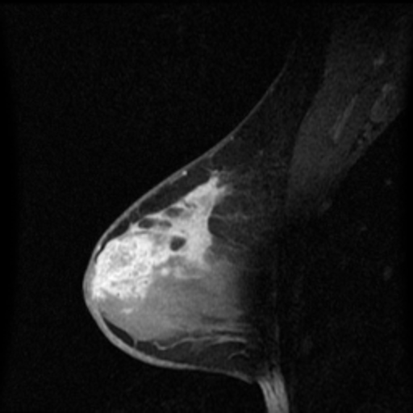</td>
<td></td>
<td></td>
</tr>
<tr>
<td>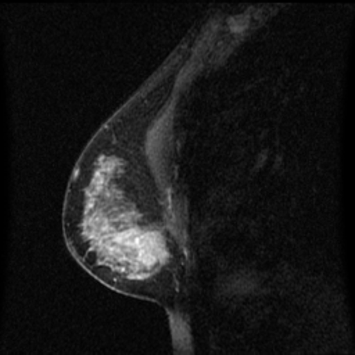</td>
<td>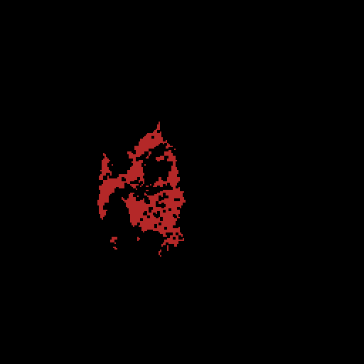</td>
<td></td>
</tr>
<tr>
<td>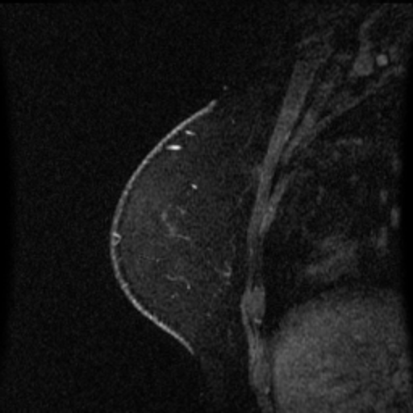</td>
<td>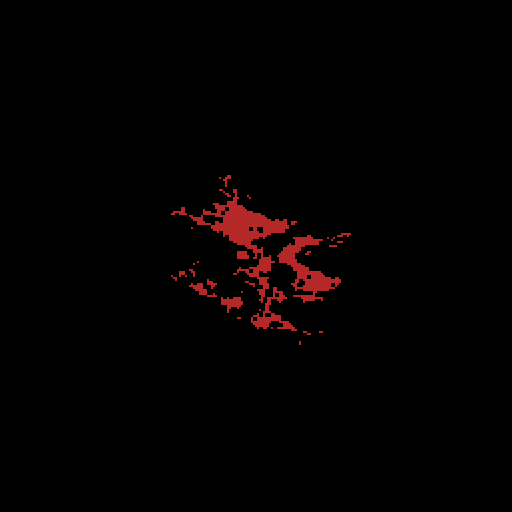</td>
<td></td>
</tr>
</table>

 
<h3>1. Dataset Citation</h3>
The dataset used here was derived from   
<a href="https://www.kaggle.com/datasets/programminghero009/breast-dcedl">
<b>BreastDCEDL: 3D Breast MRI Dataset
</b></a>  
DCE-MRI scans, segmentations, and clinical metadata for 2,070 patients 
by Neural Forge.
 
 
The following explanation was taken from the website above.  
<b>About Dataset</b> 
<b>Description</b> 
BreastDCEDL is a curated, deep learning–ready dataset composed of 3D Dynamic Contrast-Enhanced (DCE) MRI scans. 
This resource was developed to support advanced artificial intelligence research in breast cancer. 
It specifically enables the training and evaluation of transformer-based architectures (such as ViT) 
and other deep learning models for tasks like pCR prediction and tumor segmentation.
  
The dataset contains records from 2,070 breast cancer patients. The provided data includes: 
<ul>
<li>Pre-treatment 3D MRI volumes.</li>
<li>3D tumor segmentations.</li>
<li>Harmonized clinical and demographic metadata.</li>
<li>Specific clinical labels including pathologic complete response (pCR), hormone receptor (HR), HER2 status, age, and race.</li>
</ul>
<b>Source Data</b> 
The records are aggregated from three major clinical trials available through The Cancer Imaging Archive (TCIA):
<ul>
<li>I-SPY1</li>
<li>I-SPY2</li>
<li>Duke</li>
</ul>
<b>License and Usage</b> 
<ul>
<li>
This dataset is released under the Creative Commons Attribution-NonCommercial 4.0 International (CC BY-NC 4.0) license.
</li>
<li>Because it is a derivative dataset integrating multiple sources, it adopts the most restrictive license of its components.
</li>
<li>
While the I-SPY 1 dataset (CC BY 3.0) and I-SPY 2 dataset (CC BY 4.0) permit commercial use, the Duke Breast Cancer MRI datas
et restricts it.
</li>
<li>
Users may freely share and adapt the data for non-commercial purposes with appropriate attribution.
</li>
<li>
For commercial applications involving the Duke-derived data, users should contact the original data providers directly through TCIA.
</li>
</ul>
<b>Related Resources</b> 
<ul>
<li>Original Creators: Naomi Fridman, Bubby Solway, Tomer Fridman, and Itamar Barnea.</li>
<li>Paper: The dataset is described in the journal article available at arXiv:2506.12190.</li>
<li>Code Repository: The associated Python software is actively developed and hosted at
<a href="https://github.com/naomifridman/BreastDCEDL">https://github.com/naomifridman/BreastDCEDL</a>.</li>
</ul>
 
<h3>
2 BreastDCEDL ImageMask Dataset
</h3>
<h3>2.1 Download ImageMask Dataset</h3>
 If you would like to train this BreastDCEDL Segmentation model by yourself,
 please download the dataset from Google Drive  
 <a href="https://drive.google.com/file/d/1P5CXf19Ca0cafLNAaaLIXo_BzHvgBEl_/view?usp=sharing">
BreastDCEDL-ImageMask-Dataset.zip</a> (<a href="https://creativecommons.org/licenses/by/4.0/">CC BY-NC 4.0</a>)
, expand the downloaded ImageMaskDataset and put it under <b>./dataset</b> folder to be
 
<pre>
./dataset
└─BreastDCEDL
    ├─test
    │   ├─images
    │   └─masks
    ├─train
    │   ├─images
    │   └─masks
    └─valid
         ├─images
         └─masks
</pre>
 
<b>BreastDCEDL Statistics</b> 
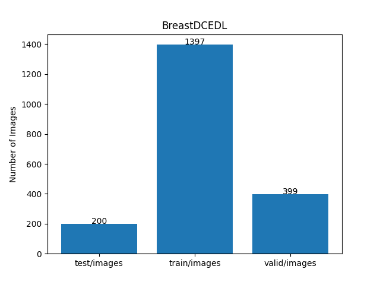 
 
As shown above, the number of images of train and valid datasets is not enough to use for the
 training set of our segmentation model.
 
 
<h3>2.2 Derivation of ImageMask Dataset</h3>
The folder of the original <b>BreastDCEDL_spy1</b> dataset is the following. 
<pre>
./BreastDCEDL_spy1
  ├─spt1_dce
  │   ├─ISPY1_1001_spy1_vis1_acq0.nii
...
  │   └─ISPY1_1239_spy1_vis1_acq2.nii
  │  
  └─spy1_mask
       ├─ISPY1_1001_spy1_vis1_mask.nii
...
       └─ISPY1_1239_spy1_vis1_mask.nii
</pre>
We generated the 512x512 pixels upscaled ImageMask Dataset from all pairs of image slices of 3D volume <b>ISPY1_*.nii</b> in 
<b>spt1_dce</b> folder  and their corresponding 
mask slices of 3D volume <b>ISPY1_*.nii</b> in <b>spy1_mask</b> folder.
However, for simplicity, we excluded all empty black mask and their corresponding image slices of the NIfTI volumes, 
because they were irrelevant to train our segmentation model. 
 
<b>Note</b> 
We found that the number of slices of some NIfTI files in <b>spt1_dce</b> 
is different from that of their corresponding mask NIfTI files in <b>spy1_mask</b>, and ignored those cases.
  
<h3>2.3 Train Sample Images and Masks</h3>

<b>Train sample images</b> 
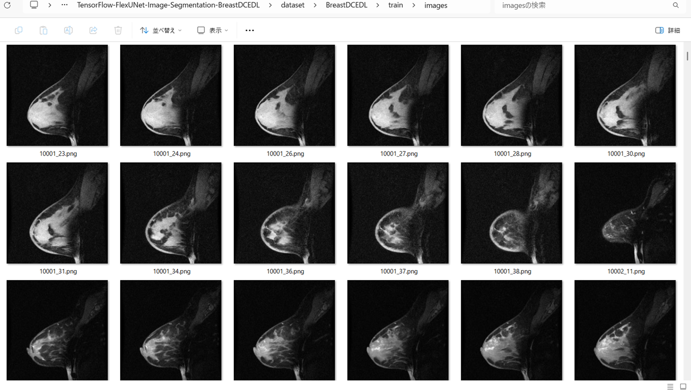
 
<b>Train sample masks</b> 
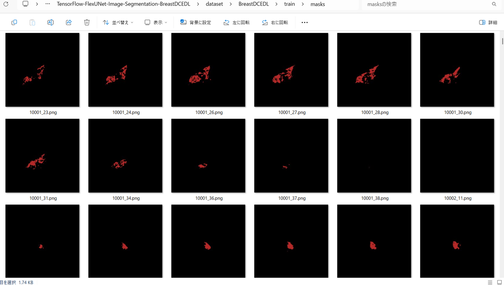
 
<h3>
3 Train TensorFlowFlexUNet Model
</h3>
 We trained BreastDCEDL TensorFlowFlexUNet Model by using the 
<a href="./projects/TensorFlowFlexUNet/BreastDCEDL/train_eval_infer.config"> <b>train_eval_infer.config</b></a> file.  
Please move to ./projects/TensorFlowFlexUNet/BreastDCEDL and run the following bat file. 
<pre>
>1.train.bat
</pre>
, which simply runs the following command. 
<pre>
>python ../../../src/TensorFlowFlexUNetTrainer.py ./train_eval_infer.config
</pre>

<b>Model parameters</b> 
Defined a small <b>base_filters = 16 </b> and large <b>base_kernels = (11,11)</b> for the first Conv Layer of Encoder Block of 
<a href="./src/TensorFlowFlexUNet.py">TensorFlowFlexUNet.py</a> 
and a large <b>num_layers = 8</b> (including a bridge between Encoder and Decoder Blocks).
<pre>
[model]
;You may specify your own UNet class derived from our TensorFlowFlexModel
model         = "TensorFlowFlexUNet"
image_width    = 512
image_height   = 512
image_channels = 3
input_normalize = True
normalization  = False
num_classes    = 2
base_filters   = 16
base_kernels   = (11,11)
num_layers     = 8
dropout_rate   = 0.05
dilation       = (1,1)
</pre>
<b>Learning rate</b> 
Defined a small learning rate.  
<pre>
[model]
learning_rate  = 0.00007
</pre>
<b>Loss and metrics functions</b> 
Specified "categorical_crossentropy" and <a href="./src/dice_coef_multiclass.py">"dice_coef_multiclass"</a>. 
<pre>
[model]
loss           = "categorical_crossentropy"
metrics        = ["dice_coef_multiclass"]
</pre>
<b>Dataset class</b> 
Specifed <a href="./src/ImageCategorizedMaskDataset.py">ImageCategorizedMaskDataset</a> class. 
<pre>
[dataset]
class_name    = "ImageCategorizedMaskDataset"
</pre>
 
<b>Learning rate reducer callback</b> 
Enabled learing_rate_reducer callback, and a small reducer_patience.
<pre> 
[train]
learning_rate_reducer = True
reducer_factor     = 0.4
reducer_patience   = 4
</pre>
<b>Early stopping callback</b> 
Enabled early stopping callback with patience parameter.
<pre>
[train]
patience      = 10
</pre>
<b>RGB Color map</b> 
Specifed rgb color map dict for BreastDCEDL 1+2 classes. 
<pre>
[mask]
mask_datatyoe    = "categorized"
mask_file_format = ".png"
;BreastDCEDL rgb color map dict for 1+1 classes.
;                     Cancer:dark red
rgb_map = {(0,0,0):0, (180,40,40):1 }
</pre>
<b>Epoch change inference callback</b> 
Enabled <a href="./src/EpochChangeInferencer.py">epoch_change_infer callback</a></b>. 
<pre>
[train]
epoch_change_infer       = True
epoch_change_infer_dir   =  "./epoch_change_infer"
num_infer_images         = 6
</pre>
By using this callback, on every epoch_change, the inference procedure can be called
 for 6 images in <b>mini_test</b> folder. This will help you confirm how the predicted mask changes 
 at each epoch during your training process.  
  
As shown below, early in the model training, the predicted masks from our UNet segmentation model showed 
discouraging results.
 However, as training progressed through the epochs, the predictions gradually improved. 
   
 
<b>Epoch_change_inference output at starting (epoch 1,2,3)</b> 
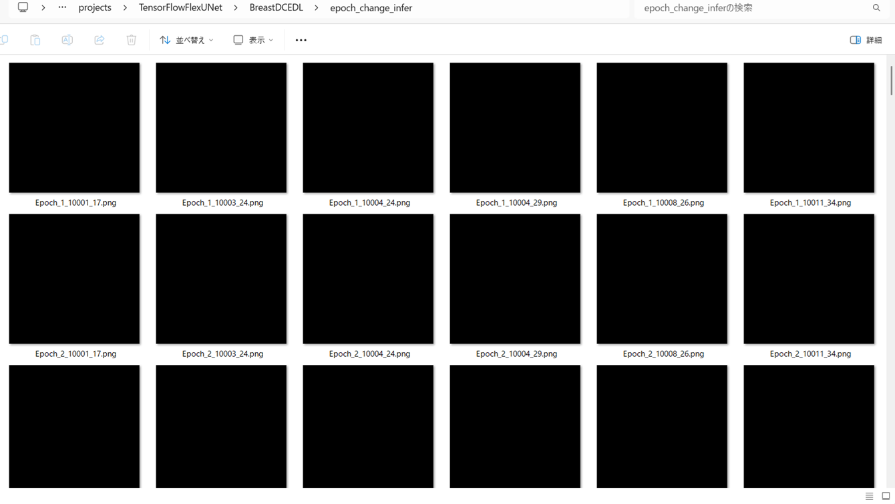 
 
<b>Epoch_change_inference output at middlepoint (epoch 18,19,20)</b> 
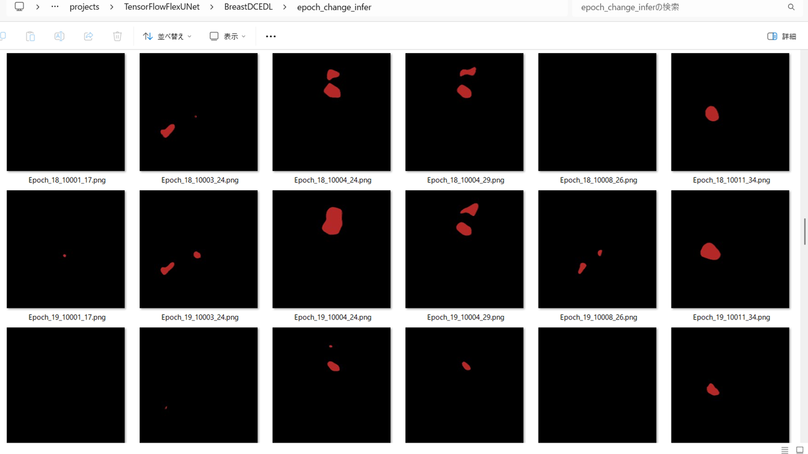 
 

<b>Epoch_change_inference output at ending (epoch 38,39,40)</b> 
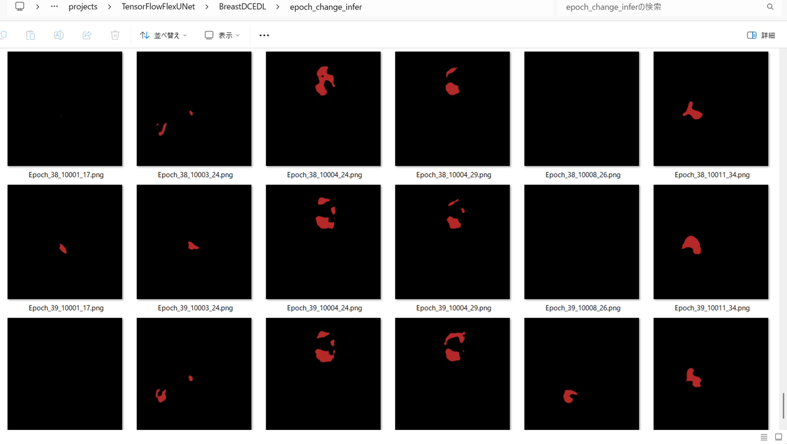 
 

In this experiment, the training process was terminated at epoch 40.  
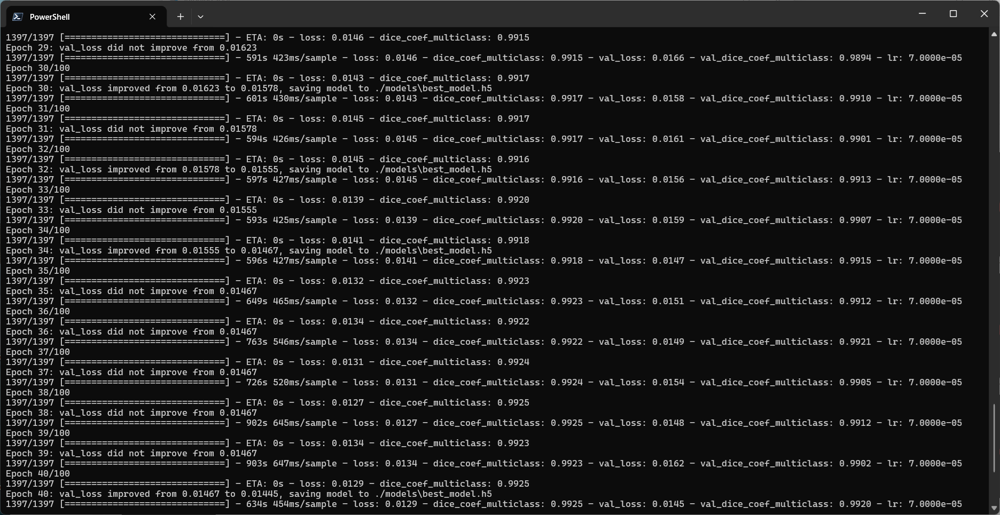 
 

<a href="./projects/TensorFlowFlexUNet/BreastDCEDL/eval/train_metrics.csv">train_metrics.csv</a> 
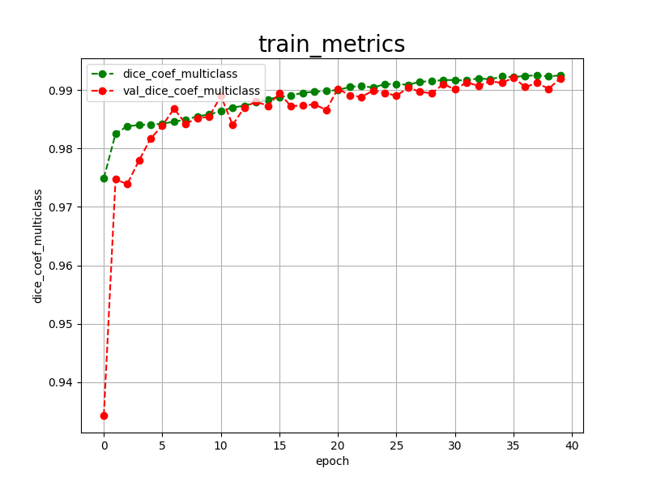 

 
<a href="./projects/TensorFlowFlexUNet/BreastDCEDL/eval/train_losses.csv">train_losses.csv</a> 
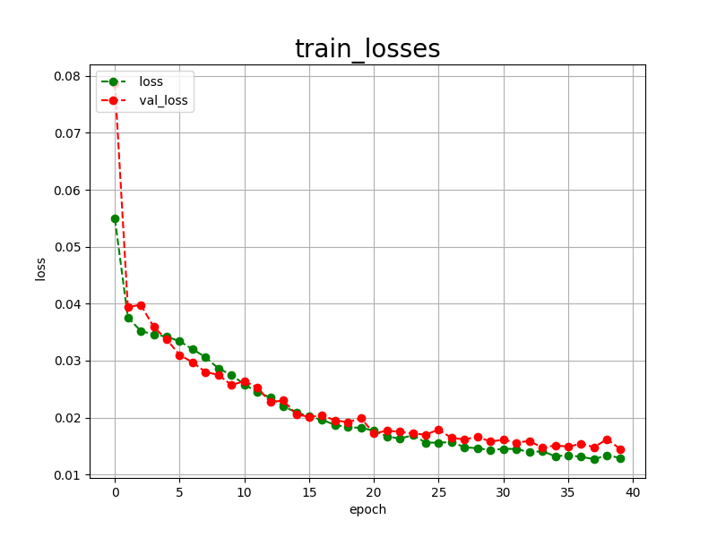 
 
<h3>
4 Evaluation
</h3>
Please move to <b>./projects/TensorFlowFlexUNet/BreastDCEDL</b> folder,
and run the following bat file to evaluate TensorFlowUNet model for BreastDCEDL. 
<pre>
>./2.evaluate.bat
</pre>
This bat file simply runs the following command.
<pre>
>python ../../../src/TensorFlowFlexUNetEvaluator.py ./train_eval_infer_aug.config
</pre>

Evaluation console output: 
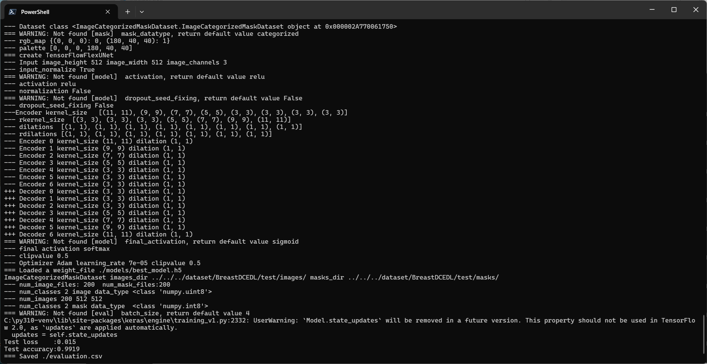
  Image-Segmentation-BreastDCEDL

<a href="./projects/TensorFlowFlexUNet/BreastDCEDL/evaluation.csv">evaluation.csv</a> 
The loss (categorical_crossentropy) to this <b>BreastDCEDL/test</b> was low and dice_coef_multiclass high as shown below.
 
<pre>
categorical_crossentropy,0.015
dice_coef_multiclass,0.9919
</pre>
 
<h3>
5 Inference
</h3>
Please move to a <b>./projects/TensorFlowFlexUNet/BreastDCEDL</b> folder 
,and run the following bat file to infer segmentation regions for images by the Trained-TensorFlowUNet model for BreastDCEDL. 
<pre>
>./3.infer.bat
</pre>
This simply runs the following command.
<pre>
>python ../../../src/TensorFlowFlexUNetInferencer.py ./train_eval_infer_aug.config
</pre>

<b>mini_test_images</b> 
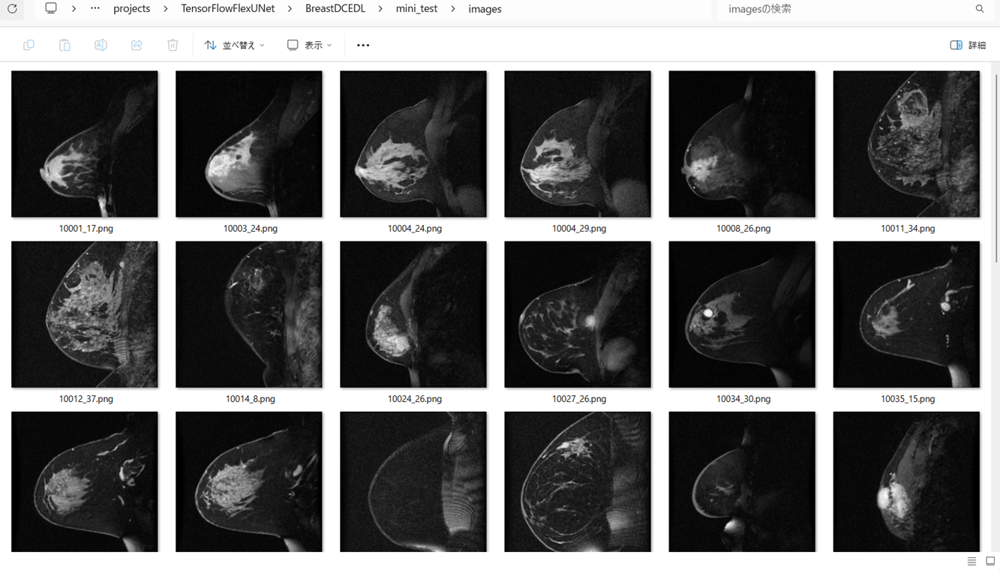 
<b>mini_test_mask(ground_truth)</b> 
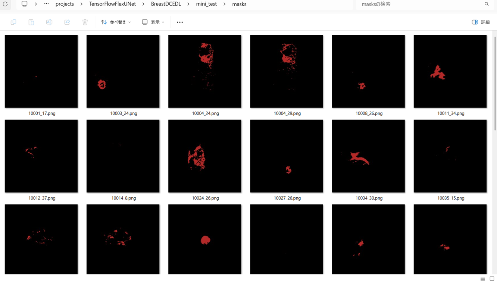 

<b>Inferred test masks</b> 
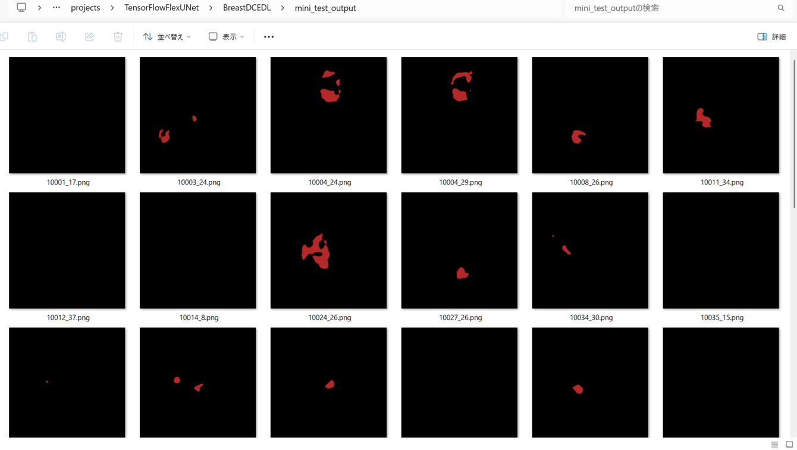 
 

<b>Enlarged images and masks of BreastDCEDL Images of 512x512 pixels</b> 
As shown below, the inferred masks predicted by our segmentation are
somewhat similar to the ground truth masks, but differ in the details.
  
<b>class-color-map = {Cancer:dark red}</b>
  
<table>
<tr>
<th>Image</th>
<th>Mask (ground_truth)</th>
<th>Inferred-mask</th>
</tr>
<tr>
<td>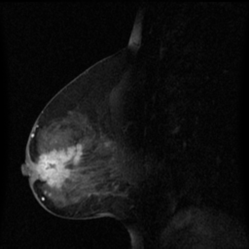</td>
<td></td>
<td></td>
</tr>
<tr>
<td>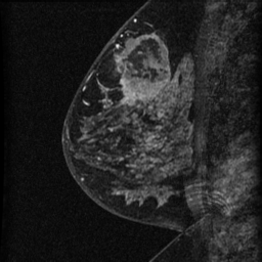</td>
<td></td>
<td></td>
</tr>
<tr>
<td></td>
<td></td>
<td></td>
</tr>
<tr>
<td>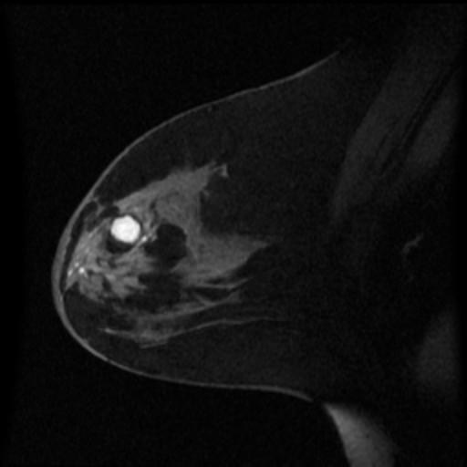</td>
<td></td>
<td></td>
</tr>
<tr>
<td>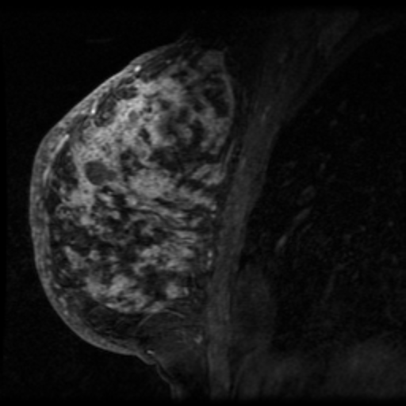</td>
<td></td>
<td></td>
</tr>
<tr>
<td></td>
<td></td>
<td></td>
</tr>
</table>

 
<h3>
6 3D Volume Segmentation
</h3>
Please move to <b>./projects/TensorFlowFlexUNet/BreastDCEDL</b> folder
,and run the following bat file to infer images segmentation for 2D slices of 3D volume NIfTI files
 by the Trained-TensorFlowFlexUNet model for BreastDCEDL. 
<pre>
>./5.infer3d.bat
</pre>
This simply runs the following command.
<pre>
>python ../../../src/TensorFlowFlexUNet3DInferencer.py ./train_eval_infer.config
</pre>
<b>infer3d section </b> in <a href="./projects/TensorFlowFlexUNet/BreastDCEDL/train_eval_infer.config">
train_eval_infer.config
<a></b>
<pre>
[infer3d] 
;Specify an images_dir which contains NIfTI or NPY files
images_dir    = "./mini_test_3d/images/"
output_dir    = "./mini_test_3d_output/"
slice_shape_order = "dhw"
slice_normalize = True
slice_resize   = (512,512)
;Specify a cv2.rotation mode as a string.
slice_rotation = "None" 
mask_overlay  = True
</pre>

<b>Acutual Image Segmentation for 2D Slices of a BreastDCEDL NIfTI</b> 
Some Slices, Inferred Masks and Mask overlays for a 3D volume <b>ISPY1_1001_spy1_vis1_acq0.nii</b> file in 
<b>BreastDCEDL_spy1/spt1_dce</b> folder. 
 
<b>class-color-map = {Cancer:dark red}</b>
 
<table>
<tr>
<th>Image</th>
<th>Inferred-mask</th>
<th>Mask overlay</th>
</tr>

<tr>
<td>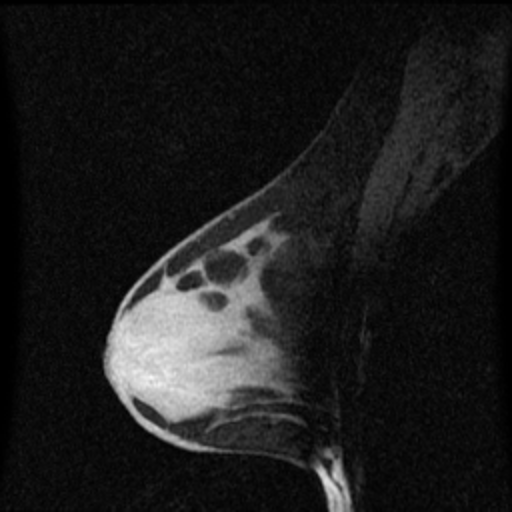</td>
<td></td>
<td>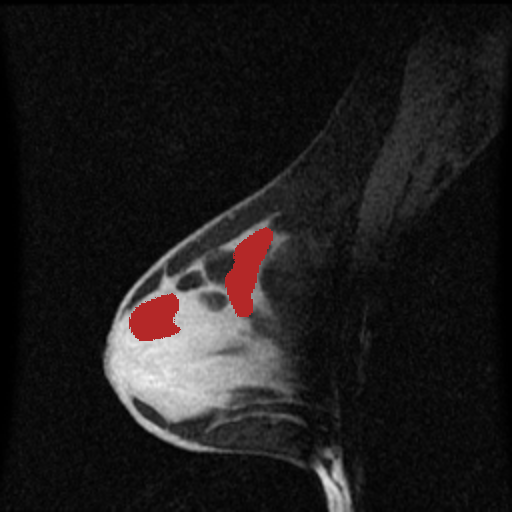</td>
</tr>

<tr>
<td>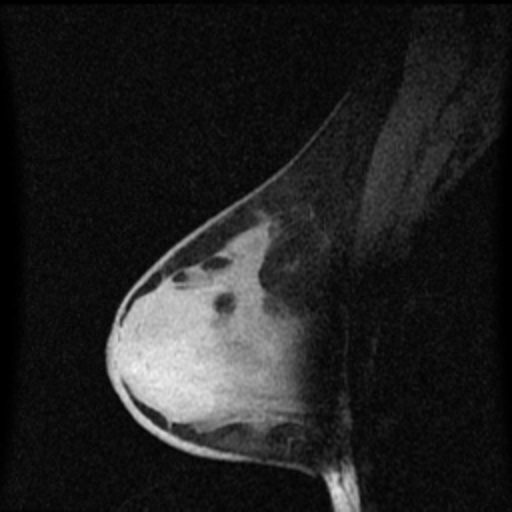</td>
<td></td>
<td>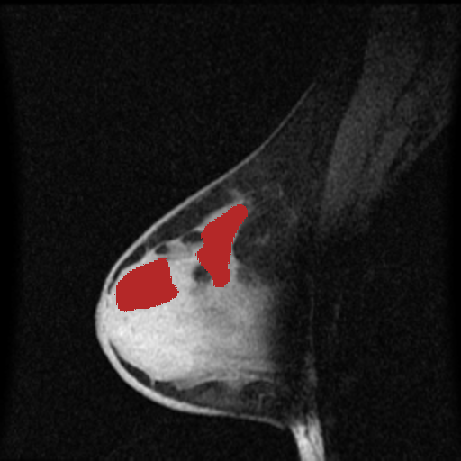</td>
</tr>
<tr>
<td>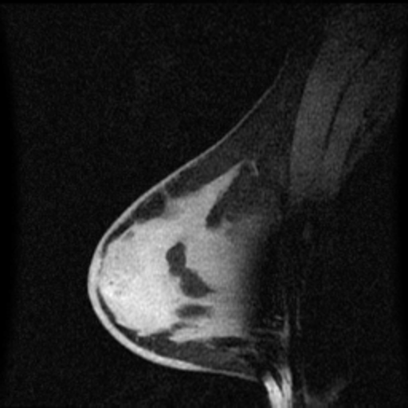</td>
<td></td>
<td>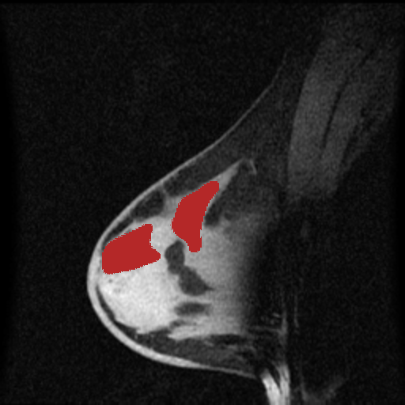</td>
</tr>
<tr>
<td>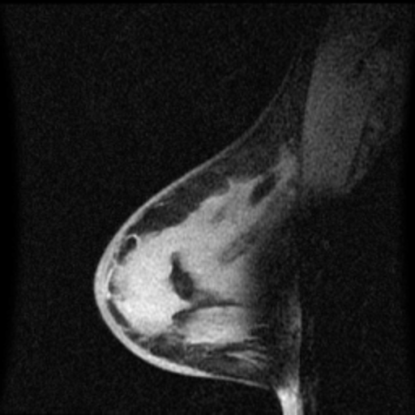</td>
<td></td>
<td>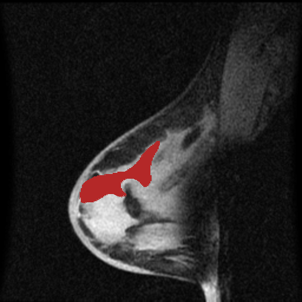</td>
</tr>
<tr>
<td>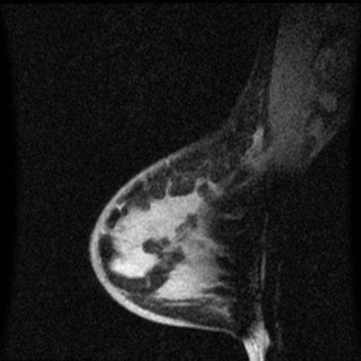</td>
<td></td>
<td>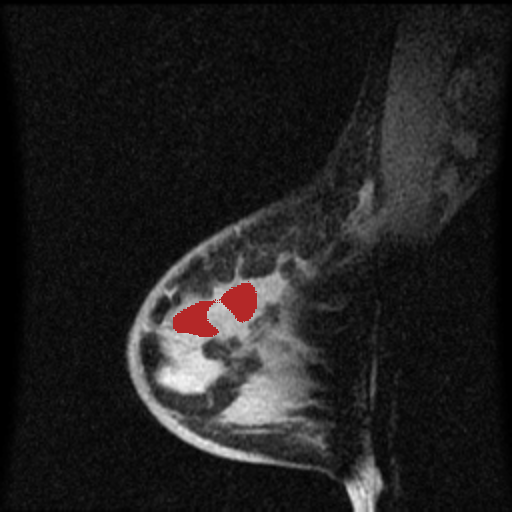</td>
</tr>
<tr>
<td>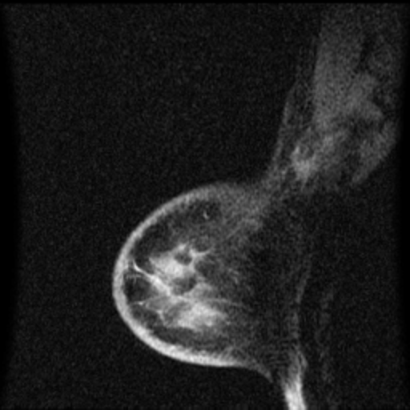</td>
<td></td>
<td>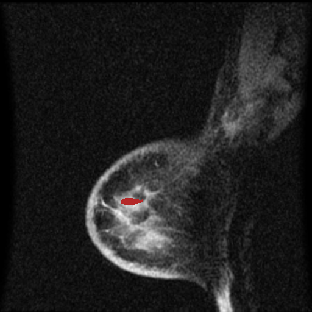</td>
</tr>
</table>

 
<h3>
7 MaskOverlay Video of 3D Volume Segmentation
</h3>
Please move to <b>./projects/TensorFlowFlexUNet/BreastDCEDL</b> folder, and run the following bat file 
to generate <b>overlays.mp4</b> or <b>overlay.gif</b> for MaskOverlays of 3D Volume Segmentation.  
<pre>
>./6.video3d.bat
</pre>
This simply runs the following command.
<pre>
>python ../../../src/MaskOverlayVideoGenerator.py ./train_eval_infer.config
</pre>
 
<b>infer3d section </b> in <a href="./projects/TensorFlowFlexUNet/BreastDCEDL/train_eval_infer.config">
train_eval_infer.config
<a></b>
<pre>
[infer3d] 
mask_overlay  = True
;Specify ".mp4" or ".gif".
;video_fileformat  = ".mp4"
video_fileformat  = ".gif"
</pre>
 
<b>overlays.gif</b> 

 
<h3>
References
</h3>
<b>1. BreastDCEDL</b> 
Naomi Fridman 
<a href="https://github.com/naomifridman/BreastDCEDL">
https://github.com/naomifridman/BreastDCEDL</a>
  

<b>2. TensorFlow-FlexUNet-Image-Segmentation-ISPY1-Breast-Cancer</b> 
Toshiyuki Arai 
<a href="https://github.com/sarah-antillia/TensorFlow-FlexUNet-Image-Segmentation-ISPY1-Breast-Cancer">
https://github.com/sarah-antillia/TensorFlow-FlexUNet-Image-Segmentation-ISPY1-Breast-Cancer
</a>
  
<b>3. TensorFlow-FlexUNet-Image-Segmentation-Model</b> 
Toshiyuki Arai 
<a href="https://github.com/sarah-antillia/TensorFlow-FlexUNet-Image-Segmentation-Model">
https://github.com/sarah-antillia/TensorFlow-FlexUNet-Image-Segmentation-Model</a>
  

